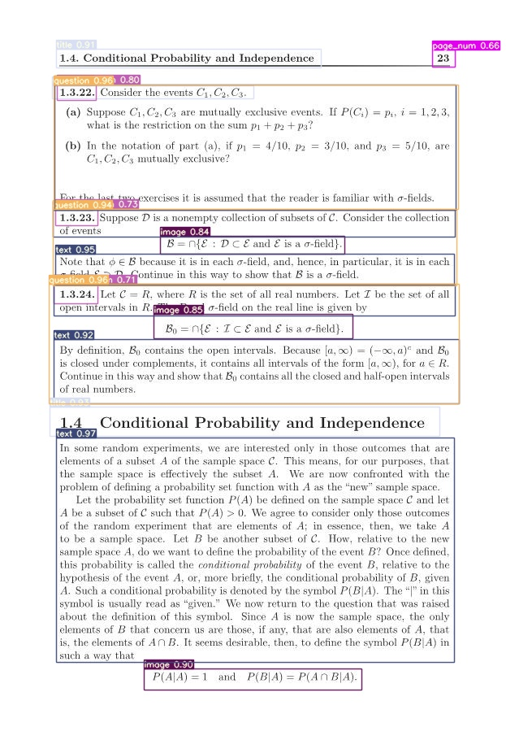
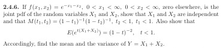
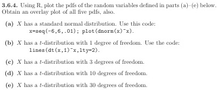

# YOLO v7 for Detecting Exercise Questions in Textbook

## Fine-Tuning
Download the pretrained parameter([link](https://drive.google.com/drive/folders/1irEt-TOAn0N1XDr1AVw2OAW9sxGzWatE?usp=sharing)).

- `yolov7x.pt`: pretrained parameter for YOLOv7-X model
- `YOLOv7_fine_tuned_params.pt`: pretrained parameter for detecting exercise questions by a textbook, **Introduction to Mathematical Statistics, 8th edition**


### Single GPU finetuning for custom dataset

```
git clone https://github.com/WongKinYiu/yolov7
cd yolov7
```

Run the code for training.
```
python train.py --epochs 10 --workers 8 --device 0 --batch-size 16 \
--data {location of data.yaml file} \
--img 623 905 --weights YOLOv7_fine_tuned_params.pt \
--notest \
--name yolov7_normal_model_finetuning --hyp ./data/hyp.scratch.custom.yaml
```

<details>
<summary> ex. </summary>
<div markdwon="1">
<pre><code>
python train.py --epochs 10 --workers 8 --device 0 --batch-size 16 \
--data /content/drive/MyDrive/Github/dataset/textbook_data_for_yolov7/data.yaml \
--img 623 905 --weights YOLOv7_fine_tuned_params.pt \
--notest \
--name yolov7_normal_model_finetuning --hyp ./data/hyp.scratch.custom.yaml
</pre></code>
</div>
</details>

## Detecting Exercise Questions in Textbook
Move the `detect_and_crop_questions.py` file to `yolov7` directory.

### Detecting Exercise Questions in a Page
```
python detect.py --weights YOLOv7_fine_tuned_params.pt \
--img-size 640 --conf-thres 0.25 --device 0 --save-txt\
--source {path of an image}
```

<details>
<summary> ex </summary>
<div markdown="1">
<pre><code>
python detect.py --weights YOLOv7_fine_tuned_params.pt \
--img-size 640 --conf-thres 0.25 --device 0 --save-txt\
--source /example_images1/Introduction-to-Mathematical-Statistics-8th-Edition-by-Robert-Hogg-Joseph-McKean-Allen-Craig_39.jpg</code>
</pre>

Example result

</div>
</details>

### Detecting Exercise Questions in Multiple Pages


```
python detect_and_crop_questions.py --weights YOLOv7_fine_tuned_params.pt \
--img-size 640 --conf-thres 0.25 --nosave --device 0 --file-format {jpg or png} \
--name extracted_questions_from_textbook \
--project {path where the cropped questions will be saved}  \
--source {path where the textbook page images are stored}
```

<details>
<summary> ex. </summary>
<div markdwon="1">
<pre><code>
python detect_and_crop_questions.py --weights YOLOv7_fine_tuned_params.pt \
--img-size 640 --conf-thres 0.25 --nosave --device 0 --file-format jpg \
--name extracted_questions_from_textbook \
--project /content/drive/MyDrive/extracted_questions_from_textbook_data_0409  \
--source /content/drive/MyDrive/mathematical_statistics_textbook
</pre></code>
</div>

Example results
- Exercise 2.4.6


- Exercise 3.6.4

</details>


